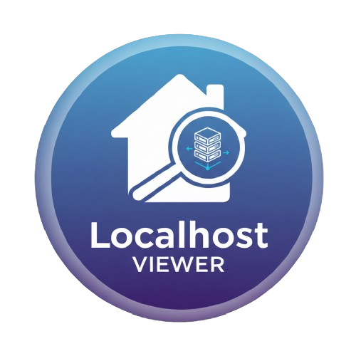
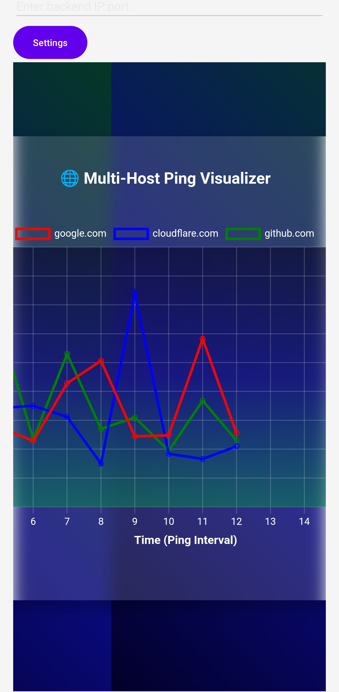

# 🏠 Localhost Viewer



A minimalistic tool to view and manage your localhost apps with a clean interface.  
Easily monitor, visualize, and interact with your running services.

---

## ✨ Features
- 🖥️ Simple UI with quick save functionality
- 🔍 Lightweight design for developers who want clarity and speed

---

## 📸 Screenshots

### Minimal UI


### Multi-Host Ping Visualizer(self hosted)


---

## 🎥 Demo Video
Check out the demo on YouTube:  
[](https://youtube.com/shorts/fOizLdQysm8?si=mO1FhvdvlOxDTCZh)

---

## 🚀 Getting Started

### Clone the repository
```bash
git clone https://github.com/astle286/localhost_viewer.git
cd localhost_viewer
Run the app
bash
npm install
npm start

📦 APK Download
You can download the latest APK from the Releases section.


🤝 Contributing
Pull requests are welcome! For major changes, please open an issue first to discuss what you’d like to change.

📄 License
This project is licensed under the MIT License.
